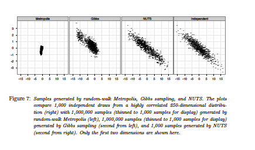

Introduction to Stan
========================================================
author: Jeffrey Arnold
date: 2017-04-13
autosize: true

Bayesian Inference
========================================================

Model the posterior distribution
$$
\begin{aligned}[t]
p(\theta|X) &= \frac{p(X | \theta) p(\theta)}{p(X)} \\
&\propto p(X | \theta) p(\theta) \\
\end{aligned}
$$

Bayesian Analysis
========================================================

Two steps:

1. Modeling: Define $p(X | \theta)$ and $p(\theta)$ that describe the data-generating process.
2. Computation: Estimate the posterior $p(\theta | X)$

How do Find the Posterior Distribution?
========================================================

Many methods:

1. Analytic, Exact Solutions : Conjugate distributions
2. Function Approximations : Laplace (MAP), Variational Bayes, Expectation Propogation
3. Sampling : Gibbs, Metropolis Hastings, **Hamiltonian Monte Carlo (HMC)**, Importance Sampling

Conjugate Distributions
========================================================

Location $\mu$ of normal distribution with *known* scale $\sigma$:

- Prior: $\mu \sim N(\mu_0, \sigma_0)$
- Likelihood: $x \sim N(\mu, \sigma^2)$
- Posterior: $\mu | x \sim N\left(\left[\frac{\mu_0}{\sigma_0^2} + \frac{\sum_{i = 1}^n x_i}{\sigma^2}\right] \middle/ \left[ \frac{1}{\sigma_0^2 } + \frac{n}{\sigma_0^2} \right], \left( \frac{1}{\sigma_0^2} + \frac{n}{\sigma^2} \right)^{-1}\right)$

Why not always ?

- Few known examples
- Most are univariate or simple distributions

========================================================

Stan
========================================================

1. *Modeling*: Probabilistic programming language to define models
2. *Computation*: Hamiltonian Monte Carlo

(Mostly) black-boxes *computation* so you can focus on *modeling*

Hamiltonian Monte Carlo
========================================================

Hamiltonian Monte Carlo
========================================================

Visualizations of two MCMC algorithms:

- [Random Walk Metropolis Hastings](https://chi-feng.github.io/mcmc-demo/app.html#RandomWalkMH,banana)
- [Hamiltonian Monte Carlo (NUTS)](https://chi-feng.github.io/mcmc-demo/app.html#HamiltonianMC,banana)

What's Next
============

Creating and Estimating Models with Stan
